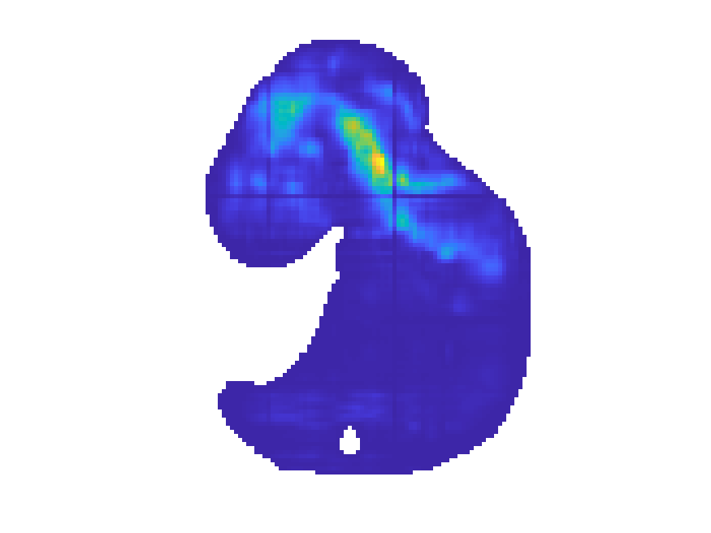

# GraphTucker

# An example of running GraphTucker on a mouse embryo Stereo-seq dataset and visualizing the resulting components

This repository provides code we used to run GraphTucker on a MOSTA Stereo-seq mouse embryo (day 9.5) dataset1 to obtain an imputed spatial gene expression tensor in Tucker form, and visualize the resulting spatial components. Please review the system and add-on requirements below. 

Figure A4 shows the Tucker decomposition of a spatial gene expression tensor into its components, which consists of a core tensor and three factor matrices (one for each mode). This decomposition is graph-regularized by a Cartesian product graph consisting of two spatial chain graphs and a PPI network as shown in Figure B. Figure C  demonstrates how the spatial component tensor can be constructed from the Tucker components. 

The code provided here demonstrates how to run GraphTucker on a spatial gene expression tensor to obtain graph-regularized Tucker components, and then visualizing the spatial components found.

## System and add-on requirements

Code for this mouse embryo dataset was tested on a machine with Linux (Ubuntu 20.04.6 LTS) with the following specifications:

CPU: Intel® Xeon® E52687W v33.10GHz, 25M Cache
Cores: 20
Memory: 256GB

Note that the necessary memory/RAM for running GraphTucker on the MOSTA_9.5 dataset is significantly lower - we observed ~13GB of memory being used during the algorithm itself, so we recommend at least 16GB of memory.

We use the most up to date MATLAB version R2023b for all implementations. 

MATLAB add-on requirements:
The only add-on needed is the Tensor Toolbox for MATLAB, Version 3.62 (https://www.tensortoolbox.org/), which is included in the repository in the `GT_utils` folder.

## Step 0: Obtaining preprocessed data

We provide an example MOSTA Stereo-seq mouse embryo (day 9.5) dataset that has been preprocessed into tensor format. We also provide the corresponding gene name and mouse PPI for [BioGRID](https://thebiogrid.org/) that can be used for imputation/graph regularization. This data is provided in the repository in `data.zip`. Simply unzip it into its own folder to use in this code.

We will also be providing detailed preprocessing steps on how to convert raw Stereo-seq data into a spatial gene expression tensor (coming soon).

Here is a description of each data file and their general formatting: 

1. MOSTA_9.5_tensor.mat
   - spatial gene expression tensor, stored as a `int64`. Loaded in and used as a `tensor` object.
   - size (n_x, n_y, n_g) before pre-processing: (80, 107, 11153) 
   - size (n_x, n_y, n_g) after pre-processing: (80, 107, 9687) 
3. MOSTA_9.5_gene_names.csv
   - list of gene names corresponding to 11153 genes in the spatial gene expression tensor. This file contains the Ensembl ID and gene symbol for each gene.
5. MUS_PPI.mat
   - Version 4.4.226 Mus musculus PPI network from BioGRID that was used for testing.
   - Contains variables `MUS_GENE` which gives gene symbols and `MUS_BIOGRID` which is the adjacency matrix for the network (size: 11153 x 11153).
   - Can be replaced with any version of the network, provided the .mat file formatting is the same.

## Step 1: Running GraphTucker to obtain imputed spatial gene expression tensor and Tucker components

GraphTucker can be run on the mouse embryo dataset by running the `GraphTucker_main.m` script. The only necessary changes needed to run the script are to change the `work_path` and `data_path` variables to the paths the GraphTucker and MOSTA_9.5 folders were downloaded to, respectfully.

GraphTucker parameters are defaulted to rank=(64,64,64), lambda=0.1, with 5000 max iterations. Runtime for the MOSTA_9.5 dataset on our machine takes ~6-7 hours. The max iterations can be lowered to significantly reduce runtime, though the  approximation error may suffer as a result.

## Step 2: Visualizing spatial components output by GraphTucker

To visualize the spatial components output by GraphTucker, run `visualize_GraphTucker_spatial_components.m` script. Again, ensure the path variables are correct. This script will automatically save visualizations (as .pngs) of each spatial component into a distinct folder depending on the rank and lambda used. We include the spatial component images for MOSTA_9.5 obtained from running GraphTucker with the default parameters. Here are three example spatial components that show how they are visualized:

**Spatial component 1**

**Spatial component 15**

**Spatial component 60**

## References

1. Chen, A., Liao, S., Cheng, M., Ma, K., Wu, L., Lai, Y., ... & Wang, J. (2022). Spatiotemporal transcriptomic atlas of mouse organogenesis using DNA nanoball-patterned arrays. Cell, 185(10), 1777-1792. DOI: 10.1016/j.cell.2022.04.003
2. Brett W. Bader, Tamara G. Kolda and others, Tensor Toolbox for MATLAB, Version 3.6, www.tensortoolbox.org, September 28, 2023. 
3. Stark, C., Breitkreutz, B. J., Reguly, T., Boucher, L., Breitkreutz, A., & Tyers, M. (2006). BioGRID: a general repository for interaction datasets. Nucleic acids research, 34(Database issue), D535–D539. https://doi.org/10.1093/nar/gkj109
